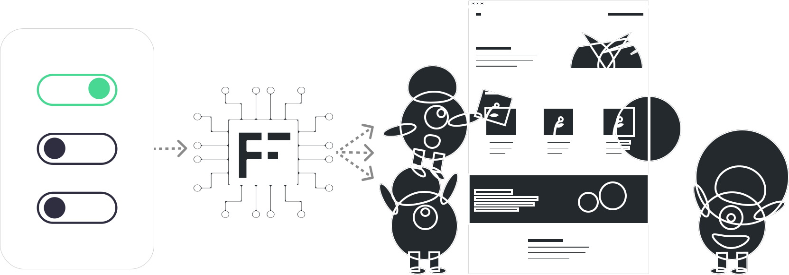

# Flagbase

[Flagbase](https://flagbase.com) is an open source feature management platform, enabling you to manage, track and deliver feature flags to all your applications.

   

## Status
Flagbase is **NOT production** ready.

We're still in the process of building the MVP. You can join us on [slack](https://flagbase.slack.com) in the [#oss-team](https://flagbase.slack.com/archives/C01A58GCR9Q) channel.

## Features

Flagbase is quite minimal at it core, yet extendable to suite your organisation's needs. Flagbase offers the following features:
* Minimalist/composable targeting rules
* Percentage rollouts + configurable hashing function (used for bucketing)
* Multiple transports (HTTP long-polling, SSE, gRPC)
* Robust Identity & Access Management (IAM) that uses a hybrid RBAC/ABAC design policy based access control
* Extend to use additional contextual data from flag evaluations, using your own data sources
* Self hosted: can be provisioned to the cloud of your choice or run on-prem

## Getting started
Flagbase is very easy to get up and running. Follow these steps to get started:
1. [Set up the core](https://flagbase.com/docs/core/setup): provision the service on server(s). You can use your preferred cloud vendor.
1. [Integrate to your application](https://flagbase.com/docs/sdk/overview): use the SDK in your application to wrap features you want to control remotely.
1. [Configure targeting](https://flagbase.com/docs/guides/targeting): set up your flag's targeting rules so users see feature variations intended for them.

That's it! Now your ready to release your feature code - knowing that you'll be able to turn it off anytime 🚀

## Directories
This [monorepo](https://en.wikipedia.org/wiki/Monorepo) contains the code for Flagbase Core, UI & SDKs.
* **[`/core`](./core/README.md)**: Code for `flagbased`, the service used to manage protected resources and stream feature flags to the SDKs. This service can be run in multiple worker modes, including `poller`, `streamer` and `API`.
* **[`/sdk`](./sdk/README.md)**: SDKs retrieve and evaluate feature flags from the service.
* **[`/ui`](./ui/README.md)**: UI interacts with the [Core API](https://flagbase.com/docs/api). It is used to manage resources (e.g. workspaces, projects, environments, flags etc).

## Support
Please [raise an issue](https://github.com/flagbase/flagbase/issues) and label it with `help wanted` or `question` for any help.

## Contributing
We encourage community contributions via pull requests. Before opening up a PR, please read our [contributor guidelines](https://flagbase.com/dev/intro/workflow#contributing).

Join us on [Github Dicussions](https://github.com/flagbase/flagbase/discussions).
* [Announcements](https://github.com/flagbase/flagbase/discussions/categories/announcements):  General PSAs & feature updates
* [Development](https://github.com/flagbase/flagbase/discussions/categories/dev): Where contributers discuss ideas
* [Help](https://github.com/flagbase/flagbase/discussions/categories/help): Stuck on something? Ask for help here :)

## Other Resources
* [Architecture](https://flagbase.com/dev/core/architecture)
* [Data models](https://flagbase.com/dev/core/data-models)

## License
Mozilla Public License Version 2.0, see [LICENSE](./LICENSE)
