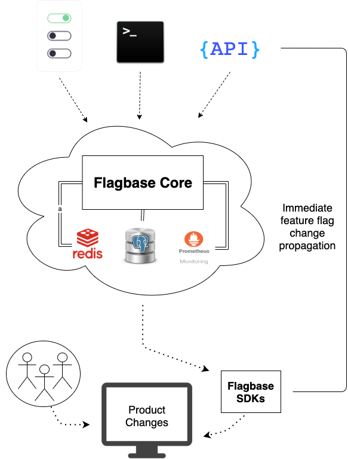
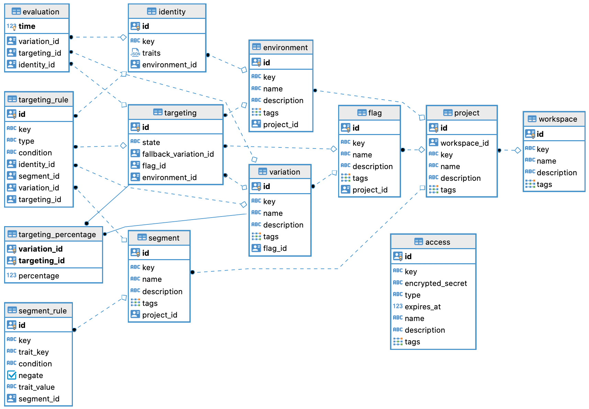

   

   

  
  
  
  

Flagbase is an all-in-one feature management solution. Flagbase offers two delivery mechanisms for transporting flagsets including both polling and streaming via [SSE (Server-Sent Events)](https://developer.mozilla.org/en-US/docs/Web/API/Server-sent_events/Using_server-sent_events). Flagbase also offers features such as targeted rollouts, auditing and extensive service monitoring via [Prometheus](https://prometheus.io).

## Architecture overview

### ER Diagram

## Directories
This [monorepo](https://en.wikipedia.org/wiki/Monorepo) contains the code for Flagbase Core, CLI, SDKs. It also contains the [user](./docs/README.md) and [maintainer](./dev/README.md) docs.
* *[`/core`](./core/README.md)*: The primary resource provider. This microservice consists of the key services used to manage protected resources and stream evaluated flagsets down to consumers (via the SDK). [Read more](./core/README.md)
* *[`/sdk`](./sdk/README.md)*: SDKs use to retrieve evaluated flagsets from the Core. [Read more](./sdk/README.md)
* *[`/cli`](./cli/README.md)*: CLI interacts with the [Core's API](https://flagbase.com/docs/api) is used to manage resources (e.g. workspaces, projects, environments, flags etc). [Read more](./cli/README.md)

## Community
Join us on [Spectrum](https://spectrum.chat/flagbase).
* [Help](https://spectrum.chat/flagbase/help): Stuck on something? Ask for help here :)
* [Development](https://spectrum.chat/flagbase/dev): where contributers discuss ideas and ask questions

## Contributing
Refer to [dev/contributing](./dev/contributing/1_overview.md).

## License
Mozilla Public License Version 2.0, see [LICENSE](./LICENSE)
